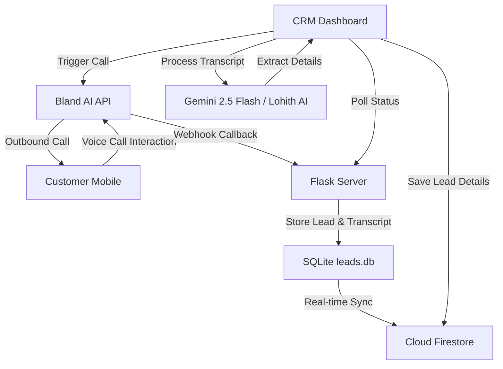

# Lohithadharma Projects Outbound AI & Voice Analytics Pipeline

This repository contains the CRM and Outbound AI agent integration for Lohithadharma Projects Pvt. Ltd. The system enables automated calling of leads, call tracking, and AI-driven analysis of transcripts.

## Pipeline Architecture & Flow



### 1. Outbound Call Triggering
- Phone calls are triggered from the **CRM Dashboard** via the `POST /api/calls/trigger` endpoint.
- If a Bland AI API key is configured, the server initiates an outbound call utilizing Bland AI's voice agent network.
- The webhook base URL (e.g. ngrok public URL) is supplied to Bland AI so that the call data is posted back when the interaction ends.

### 2. Post-Call Webhook & Sync
- Once the call is hung up, Bland AI posts the details (concatenated transcript, call length, recording URL) to the `POST /api/calls/webhook` endpoint.
- The server parses the transcript, saves the call details to the SQLite database (`leads.db`), updates status fields, and synchronizes the lead information with Google Cloud Firestore in real time.

### 3. Direct Transcript Details Extraction
- Under **Call History**, the user can process any finished call transcript with Lohith AI (Gemini).
- Instead of downloading, proxying, and transcribing heavy audio files, the dashboard takes the saved transcript text and performs the extraction directly.
- **Redirection & Verification**: Clicking "Process with Lohith AI" redirects to the **Voice Capture** tab, auto-populates the transcript text area, and triggers Gemini details extraction.
- **Smart Retries**: If network or API limits cause a failure, the pipeline displays an error message and automatically retries the process after 5 seconds, up to 3 attempts.

## Environment Variables
Create a `.env` file in the root directory:
```env
BLAND_API_KEY=your_bland_api_key
WEBHOOK_BASE_URL=your_public_ngrok_or_tunnel_url
```
