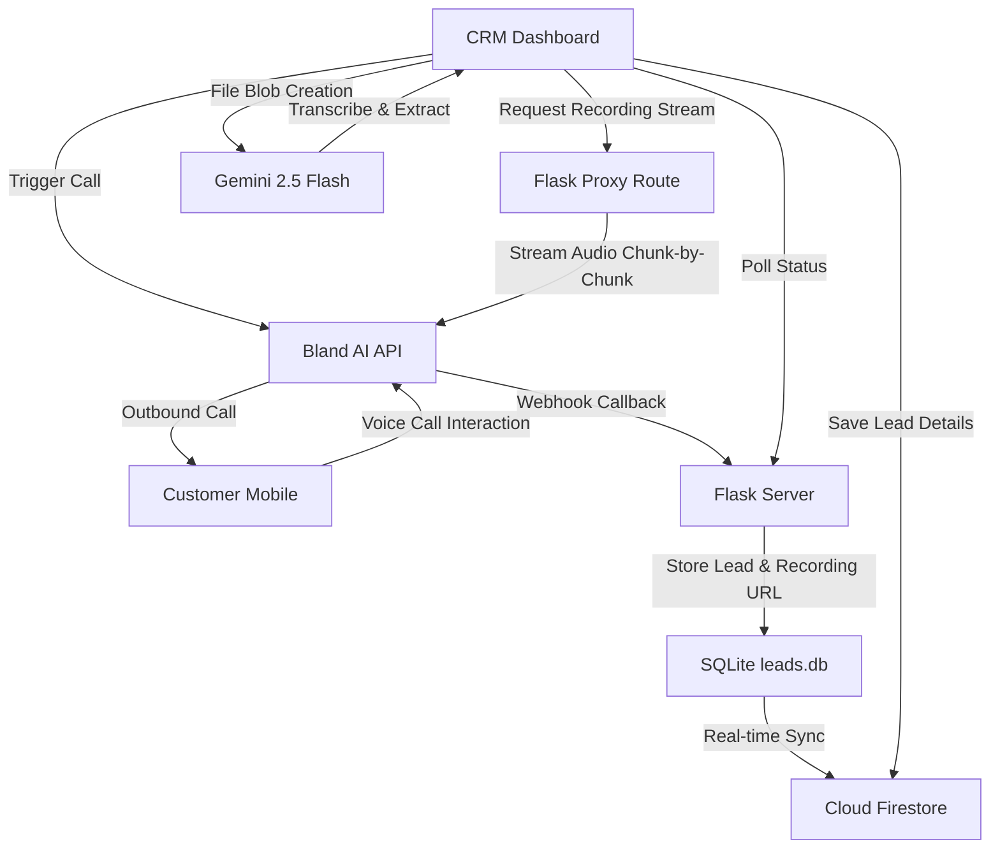

# Lohithadharma Projects Outbound AI & Voice Analytics Pipeline

This repository contains the CRM and Outbound AI agent integration for Lohithadharma Projects Pvt. Ltd. The system enables automated calling of leads, call tracking, and AI-driven analysis of recordings.

## Pipeline Architecture & Flow



### 1. Outbound Call Triggering
- Phone calls are triggered from the **CRM Dashboard** via the `POST /api/calls/trigger` endpoint.
- If a Bland AI API key is configured, the server initiates an outbound call utilizing Bland AI's voice agent network.
- The webhook base URL (e.g. ngrok public URL) is supplied to Bland AI so that the call data is posted back when the interaction ends.

### 2. Post-Call Webhook & Sync
- Once the call hung up, Bland AI posts the details (transcript, call length, recording URL) to the `POST /api/calls/webhook` endpoint.
- The server processes the transcript, saves the call details to the SQLite database (`leads.db`), updates status fields, and synchronizes the lead information with Google Cloud Firestore in real time.

### 3. Memory-Efficient Recording Proxy
- **Endpoint**: `GET /api/calls/proxy-recording?url=<bland_audio_url>`
- **Direct Passthrough Streaming**: To prevent server-side memory leaks when handling audio files, the server streams the audio chunk-by-chunk using `requests.get(url, stream=True)` and Flask's `Response` object with `direct_passthrough=True`.
- **Security Check**: A strict netloc whitelist allows the proxy to fetch audio files ONLY from `api.bland.ai`, preventing the server from being used as an open proxy.
- **Race Condition Safety**: If a recording is not yet finalized on Bland AI, the proxy returns an HTTP `202 Accepted` or `404 Not Found` instead of crashing. The frontend automatically detects this and retries checking the recording availability.

### 4. Gemini Voice Capture Pipeline
- Under **Voice Capture**, the user can process any call recording with Gemini (Lohith AI).
- The dashboard downloads the recording CORS-safely through the proxy, creates a browser `File` object, and runs Gemini's transcription and details extraction.
- **Double-Click Protection**: Interactive buttons are disabled during processing.
- **Smart Retries**: If network or API limits cause a failure, the pipeline displays an error message and automatically retries the process after 5 seconds.

## Environment Variables
Create a `.env` file in the root directory:
```env
BLAND_API_KEY=your_bland_api_key
WEBHOOK_BASE_URL=your_public_ngrok_or_tunnel_url
```
